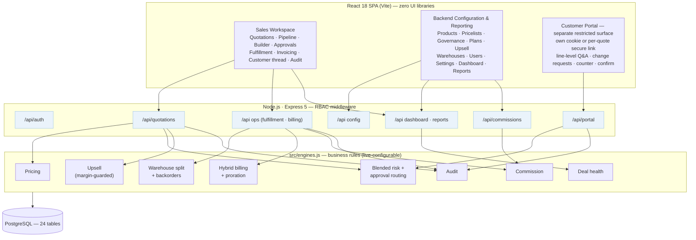
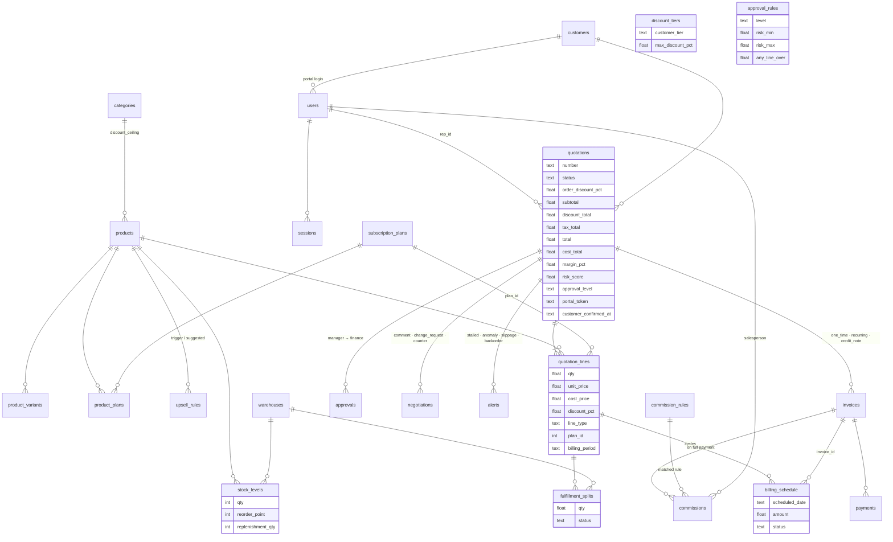

# DealFlow360 — Architecture (one page)

> Printable one-pager: **[docs/architecture.svg](architecture.svg)** (open in any browser, export to PDF from the print dialog).
> This file is the same content as GitHub-rendered Mermaid so it stays readable inline.

## 1. System layers



## 2. Data model



Also present: `price_lists` (tier × currency, discount/markup), `discount_tiers`, `approval_rules`, `settings` (thresholds), `audit_log` (every state change), `commission_rules`.

## 3. How the modules connect end-to-end

| Step | Trigger | Engine(s) | Writes |
|---|---|---|---|
| 1 Build | rep adds/edits lines, discounts, upsell | Pricing · Upsell · Risk (live) | `quotation_lines`, `quotations` totals/margin/risk |
| 2 Submit | `POST /quotations/:id/submit` | Risk → `requiredApprovalLevel` → `routeForApproval` | `approvals` chain, status `pending_manager` (or `approved`) |
| 3 Approve | manager, then finance if required | role checks, chain advance | `approvals`, status, `audit_log` |
| 4 Negotiate | portal comment / change request / counter / confirm | Risk re-evaluated on confirm | `negotiations`, `customer_confirmed_at`; re-enters step 2 if ceilings breached |
| 5 Fulfil | accept / override split · ship · restock | Warehouse split (free stock) · consolidation | `fulfillment_splits`, `stock_levels`, `alerts(backorder)` |
| 6 Bill | confirmation · qty change · cancel | Hybrid billing · proration · credit notes | `invoices`, `billing_schedule` |
| 7 Pay | `POST /invoices/:id/pay` | Commission rule matching | `payments`, invoice `paid`, `commissions` |
| 8 Monitor | dashboard poll · restock · nightly | Deal health | `alerts` (stalled · anomaly · slippage · backorder) |

### The blended discount risk score

```
allowed(line)   = min(tier ceiling, category ceiling)
effective(line) = line% + order% × (1 − line%/100)
violation(line) = max(0, effective − allowed)
risk            = worst violation + 0.5 × Σ(other violations)
level           = approval_rules match on risk range, or hard cap "any line over X%"
```

The worst line counts fully; smaller overages spread across many lines still add up — so a rep cannot keep every line
"almost within limits" while giving the order away.

## 4. Role matrix (as enforced by the API)

✅ allowed · 👤 own records only · ❌ denied

| Capability | Sales Rep | Manager | Finance | Admin | Customer (portal) |
|---|---|---|---|---|---|
| Staff login / persona switch | ✅ | ✅ | ✅ | ✅ | ❌ |
| Portal login / per-quotation secure link | ❌ | ❌ | ❌ | ❌ | ✅ |
| View quotations, pipeline, detail | ✅ | ✅ | ✅ | ✅ | ❌ |
| Create quotation | ✅ | ✅ | ✅ | ✅ | ❌ |
| Edit lines / discounts / upsell, submit, send, reply, accept or decline requests | 👤 own | ✅ | ❌ | ✅ | ❌ |
| Approve / return / reject — Manager step | ❌ | ✅ | ❌ | ✅ | ❌ |
| Approve / return / reject — Finance step | ❌ | ❌ | ✅ | ✅ | ❌ |
| Split suggestion, accept / override, ship, consolidate backorder | ✅ | ✅ | ✅ | ✅ | ❌ |
| Restock, stock levels, replenishment run, warehouses | ❌ | ❌ | ✅ | ✅ | ❌ |
| View invoices, invoice PDF, record payment, modify / cancel subscription | ✅ | ✅ | ✅ | ✅ | own quote's invoices |
| Recurring billing run, void invoice | ❌ | ❌ | ✅ | ✅ | ❌ |
| List / view own company's quotations; questions, change requests, counter, confirm | ❌ | ❌ | ❌ | ❌ | 👤 own company |
| Dashboard, alerts (nudge / escalate / dismiss), reports, exports | ✅ | ✅ | ✅ | ✅ | ❌ |
| View / confirm commissions | 👤 own | ✅ | ✅ | ✅ | ❌ |
| Approve / cancel commissions, commission rules, upsell rules, customers | ❌ | ✅ | ❌ | ✅ | ❌ |
| Settle commission payouts | ❌ | ❌ | ✅ | ✅ | ❌ |
| Products, variants, price lists, discount tiers, approval rules, plans, settings, users | ❌ | ❌ | ❌ | ✅ | ❌ |

## 5. Security model

- **Two auth surfaces**: `df_session` (staff) and `df_portal` (customers) cookies; magic links carry a per-quotation token.
- `requireInternal` rejects customers on staff routes; `requirePortal` rejects staff sessions on portal routes.
- Customers resolve quotations by `customer_id` — cross-tenant reads return 404. Verified in `test-e2e.js`.
- Passwords: scrypt with per-user salt; sessions expire after 7 days.
- Every mutation is written to `audit_log` with user, timestamp and reason.
